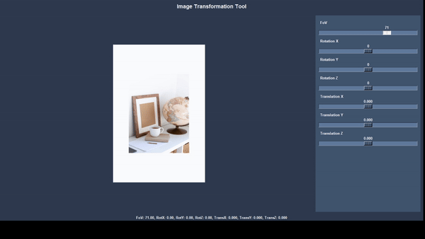

# Depth-Based Image Perspective Transformation App

This Python application applies transformations to an image in a 3D space using depth estimation. The GUI uses Tkinter, allowing users to adjust camera properties such as field of view, rotation angles, and translation to see real-time perspective changes directly in the app window.



## Features

- **Depth Estimation**: Automatically estimates the depth map of an image using DepthAnything.
- **3D Transformation**: Adjust field of view, rotation, and translation parameters to warp the image based on depth.
- **Interactive Interface**: Control parameters with Tkinter sliders for immediate, real-time transformation results.

## Requirements

- Python 3.8 or higher
- Conda (recommended for environment management)

### Install Dependencies

To install the required packages, create a new Conda environment and install dependencies:

```bash
conda create -n depth_transform python=3.9
conda activate depth_transform
pip install -r requirements.txt
```

## Usage

### 1. Run the App

Run the application from the terminal, specifying the path to an input image and optionally a depth map. If no depth map is provided, the app will generate one using the `estimate_depth` module.

#### If depth map is already available
```bash
python app.py "/path/to/image.jpg" "path/to/depthmap.npy"
```

#### If depth map is not available and needs to be estimated
```bash
python app.py "/path/to/image.jpg" ""
```

### 2. Interface Controls

The Tkinter GUI provides sliders to control the following parameters:

- **Field of View (FOV)**: Changes the camera’s field of view, allowing you to zoom in or out.
- **Rotation X, Y, Z**: Rotate the image along the x, y, and z axes to adjust the viewing angle.
- **Translation X, Y, Z**: Translate the image along the x, y, and z axes for fine positioning.

The image updates automatically as you adjust each slider, keeping the original aspect ratio for a clear, undistorted view.

### Example

```bash
python app.py images/shocked.jpg
```

Adjust the sliders in the Tkinter interface to explore different perspectives of the transformed image.

